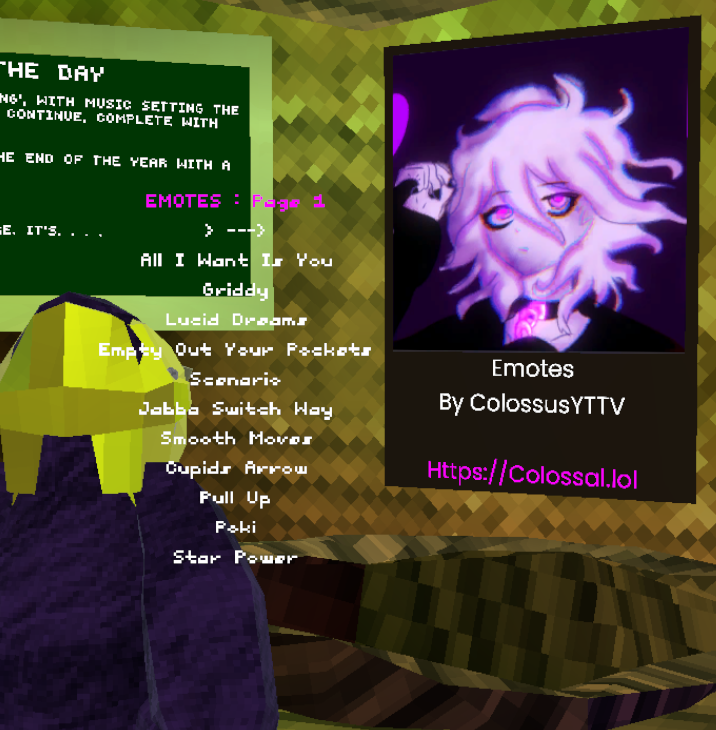

# Colossal Emotes

  
IIDK emote wheel was becoming really popular, and it was programmed like complete garbage. So I decided to redo it with way more emotes.

# Controls
### PC/Keyboard and mouse
- B (Select Emote)
- V (Stop Emote)
- Scroll Wheel
### VR
- Right Trigger (Select Emote)
- Left Trigger (Stop Emote)
- Joystick

# Install
Download the latest release
Drag the file ColossalEmotes.dll to your plugins folder
